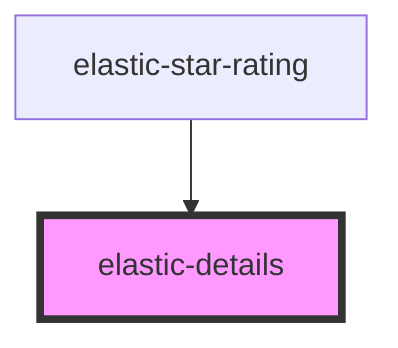

# elastic-details

<!-- Auto Generated Below -->

## Properties

| Property  | Attribute | Description | Type       | Default     |
| --------- | --------- | ----------- | ---------- | ----------- |
| `ratings` | --        |             | `number[]` | `undefined` |

## Dependencies

### Used by

 - [elastic-star-rating](../elastic-star-rating)

### Graph

----------------------------------------------

*Built with [StencilJS](https://stenciljs.com/)*
