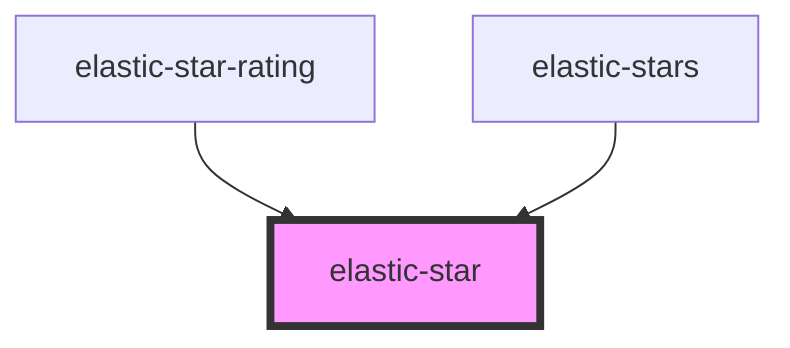

# elastic-star

<!-- Auto Generated Below -->

## Properties

| Property | Attribute | Description | Type      | Default     |
| -------- | --------- | ----------- | --------- | ----------- |
| `active` | `active`  |             | `boolean` | `undefined` |

## Dependencies

### Used by

 - [elastic-star-rating](../elastic-star-rating)
 - [elastic-stars](../elastic-stars)

### Graph

----------------------------------------------

*Built with [StencilJS](https://stenciljs.com/)*
