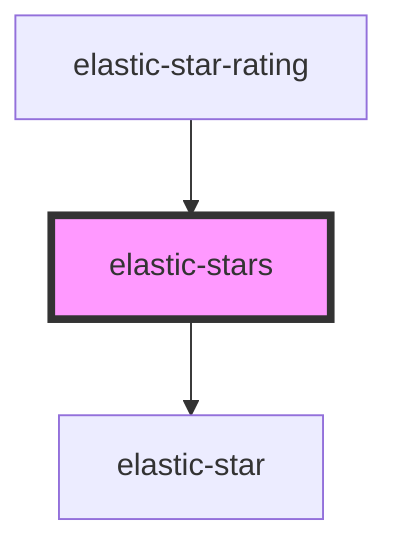

# elastic-stars

<!-- Auto Generated Below -->

## Properties

| Property    | Attribute    | Description | Type     | Default     |
| ----------- | ------------ | ----------- | -------- | ----------- |
| `maxRating` | `max-rating` |             | `number` | `undefined` |
| `value`     | `value`      |             | `number` | `undefined` |

## Events

| Event  | Description | Type                  |
| ------ | ----------- | --------------------- |
| `rate` |             | `CustomEvent<number>` |

## Dependencies

### Used by

 - [elastic-star-rating](../elastic-star-rating)

### Depends on

- [elastic-star](../elastic-star)

### Graph

----------------------------------------------

*Built with [StencilJS](https://stenciljs.com/)*
